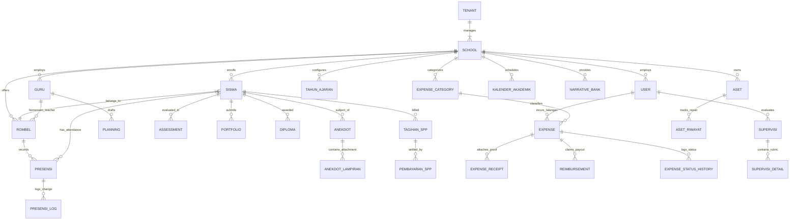
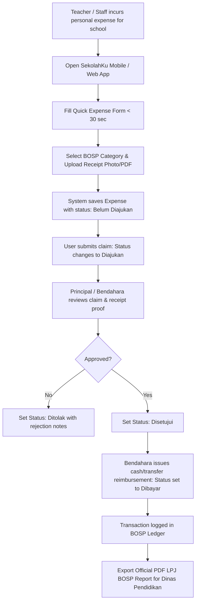
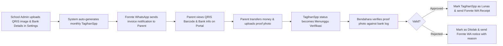
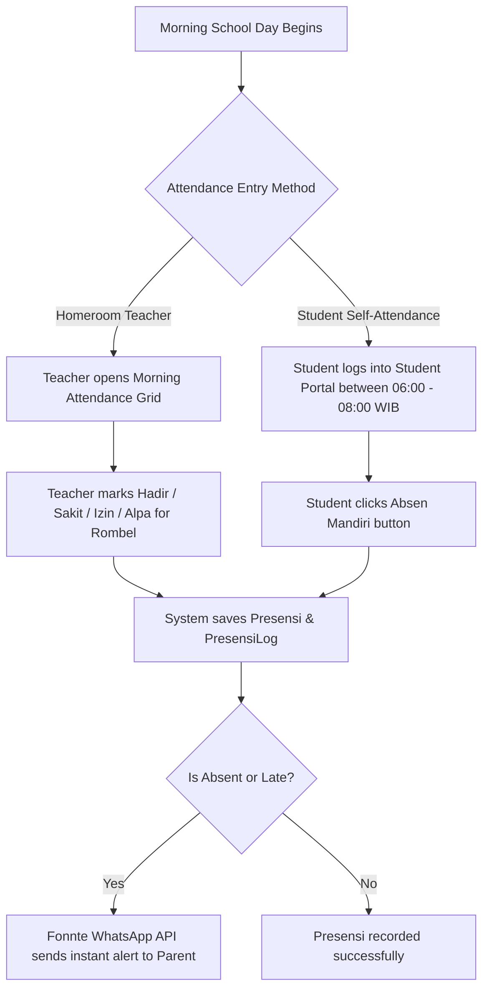

# SekolahKu SaaS Platform — Unified Master System Specification

## 1. Executive Summary

**SekolahKu** is an all-in-one, multi-tenant SaaS school management platform and digital financial assistant built for Indonesian educational institutions, ranging from preschools (PAUD/TK/RA) to primary, secondary (SD/MI, SMP/MTs, SMA/SMK/MA), and Pesantren.

SekolahKu unifies three foundational core applications into a single cloud ecosystem:
1. **SIAKAD Engine (from `siakad-ridho`)**: Master student/teacher management, class grouping (Rombel), academic calendar, daily presence logs (Teacher morning entry & Student self-attendance), behavioral/developmental anecdotal logs, lesson planning (RPPH / Modul Ajar draft & publish), school supervision (KS→Teacher, Yayasan→KS), asset management & maintenance history, and SPP billing.
2. **E-Rapor Engine (from `e-rapor TK/PAUD`)**: Kurikulum Merdeka & K13 assessment management, narrative description banks, student portfolio work archives, digital report card generation (E-Rapor PDF export with custom Kop logo), and diploma/certificate issuance (STTB/Ijazah).
3. **Financial & LPJ BOSP Digital Assistant (from `lpj-tk / BendaharaKu`)**: Manual QRIS & Bank Transfer payment with parent proof upload, mobile-first fast expense tracking for personal out-of-pocket spending (talangan pribadi), multi-photo & PDF receipt evidence management, multi-stage approval & reimbursement timeline history (`ExpenseStatusHistory`), and automated BOSP recap generation (Triwulan Q1–Q4, Semester, Annual) with official Dinas Pendidikan PDF export formatting.

SekolahKu is engineered specifically for the Indonesian educational regulatory context—supporting **NISN** (Nomor Induk Siswa Nasional), **DAPODIK** / Kemenag sync formats, Fonnte WhatsApp integration for automated parent notifications, Kurikulum Merdeka competency standards, BOS/BOSP fund accounting compliance, and Indonesian tax (PPN/VAT) requirements.

---

## 2. Product Overview & SaaS Multi-Tenancy Architecture

### 2.1 Stakeholders & Role-Based Access Control (RBAC)

SekolahKu uses strict Role-Based Access Control (scaffolded via `spatie/laravel-permission`) to isolate functionality across roles:

| Role | Scope | Key Responsibilities & Feature Permissions |
| --- | --- | --- |
| **Superadmin SaaS** | Global Platform | SaaS tenant provisioning, subscription management, global system settings, billing enforcement, system health logs. |
| **Yayasan Admin** | Multi-School Network | Cross-school financial analytics, multi-school student transfer approvals, yayasan supervision oversight, consolidated BOSP reporting. |
| **School Admin / Principal (Kepala Sekolah)** | School Tenant | Academic calendar setup, staff assignment, supervision of teachers, final approval for BOSP reimbursements, report card publishing. |
| **School Treasurer (Bendahara)** | School Finance | BOS/BOSP budget allocations, verification of talangan reimbursement claims, SPP billing & QRIS payment proof verification, general ledger reconciliation. |
| **Admin TU (Administration Staff)** | School Operational | Student admissions (PPDB), Rombel assignments, NISN & Dapodik data entry, asset inventory & repair logging. |
| **Teacher / Educator (Guru)** | Assigned Classes | Daily student morning presence logging, anecdotal development entries, lesson planning (RPPH/Modul Ajar), gradebook entry, portfolio uploads. |
| **Parent / Guardian (Orang Tua)** | Personal Children | Real-time Fonnte WhatsApp presence alerts, anecdotal child timeline view, digital report card downloads, view school QRIS & upload payment proof. |
| **Student (Siswa)** | Personal Account | Self-service morning attendance logging, view class timetable, access learning materials, attempt online quizzes, view personal attendance and grade summaries. |

---

### 2.2 Multi-Tenancy & White-Label Strategy

SekolahKu enforces tenant isolation using scoped database references (`tenant_id` and `school_id`) across all Eloquent queries.

```
                  ┌──────────────────────────────────────────┐
                  │            Superadmin SaaS               │
                  └────────────────────┬─────────────────────┘
                                       │
            ┌──────────────────────────┴──────────────────────────┐
            ▼                                                     ▼
┌───────────────────────┐                             ┌───────────────────────┐
│ Tenant: Yayasan A     │                             │ Tenant: Yayasan B     │
└───────────┬───────────┘                             └───────────┬───────────┘
            │                                                     │
     ┌──────┴──────┐                                       ┌──────┴──────┐
     ▼             ▼                                       ▼             ▼
┌─────────┐   ┌─────────┐                             ┌─────────┐   ┌─────────┐
│ TK A1   │   │ SD A2   │                             │ TK B1   │   │ SMP B2  │
└─────────┘   └─────────┘                             └─────────┘   └─────────┘
```

- **White-Label Branding**: Schools can configure custom Kop headers, logos, QRIS barcode images, bank account numbers, color themes, and custom subdomains/domains (e.g., `siakad.tknpembina.sch.id`).
- **Subscription Tiers & Feature Caps**:

| Feature / Capability | Free Tier (Rp 0) | Pro Tier (Rp 39.000 / mo) | Yayasan Tier (Rp 199.000 / mo) |
| --- | --- | --- | --- |
| **School Limits** | 1 School | 1 School (Extended Capabilities) | Multi-School Network / Branch |
| **Financial Transactions** | Max 100 Transactions | **Unlimited** | **Unlimited** |
| **Receipt Attachments** | Max 1 Photo per entry | Multi-Photo & PDF Files | Multi-Photo & PDF Files |
| **PDF Export Formatting** | Standard PDF Export | Custom Kop Logo & Signature Blocks | Combined Network PDF & Excel Exports |
| **E-Rapor & Narrative Bank** | Basic Scoring | Full Kurikulum Merdeka Narrative Bank | Custom Assessment Rubrics & Bank |
| **SPP Payment Method** | Manual Cash Entry | Manual QRIS & Bank Transfer Proof Upload | Manual QRIS & Auto-Verification |
| **Notifications** | Basic Web Alerts | Fonnte WhatsApp API Integration | Fonnte WhatsApp API Integration |
| **User Seats & Roles** | 1 Admin Account | Multi-User (Admin, KS, Bendahara, Guru) | Multi-Level & Yayasan Approvals |

---

## 3. Core Functional Modules

### Module 1: Admissions (PPDB) & Master Data Management

- **Online Admissions Workflow**: Public registration form with validation for NISN, NIK, date of birth, previous school details, and parent/guardian contact details. Supporting document upload (birth certificate, family card, previous grade transcripts).
- **Selection & Status Tracking**: Applicants pass through status stages: `Draft` → `Pending Verification` → `Approved` / `Rejected`. Upon approval, automatic student account creation and initialization of initial invoice (registration fees).
- **Master Data Management**:
  - **Siswa**: Complete student demographics, NISN, NIK, class assignment, parent links, medical records, and status (`Aktif`, `Lulus`, `Pindah`, `Drop Out`).
  - **Guru**: Teacher registry with NIP/NUPTK, employment status, academic credentials, teaching subject assignments, and homeroom teacher flags.
  - **Rombel (Rombongan Belajar)**: Class section management (e.g., TK-A1, Kelas 1-A, Kelas 7-B) mapped to academic years (`TahunAjaran`).

---

### Module 2: Academic Planning & Calendar System

- **Academic Calendar (`KalenderAkademik`)**: Interactive calendar interface tracking national holidays, school event schedules, exam periods, report card publication dates, and teacher meeting schedules.
- **Lesson Planning & Modul Ajar (`Planning`)**:
  - Teachers draft daily/weekly lesson plans (RPPH for TK/PAUD or Modul Ajar / RPP for K-12).
  - Configurable fields: Learning Outcomes (Capaian Pembelajaran), Learning Objectives (Tujuan Pembelajaran), materials, methods, and evaluation criteria.
  - Workflow status: `Draft` → `Submitted for Review` → `Approved by Principal` → `Published`.

---

### Module 3: Dual Attendance System, Daily Activity & Development Tracking

- **Dual Attendance Engine (`Presensi` & `PresensiLog`)**:
  - **Mode A: Homeroom Teacher Morning Entry (Presensi Guru)**: Homeroom teacher logs whole-class morning attendance (`Hadir`, `Izin`, `Sakit`, `Alpa`, `Terlambat`) directly via web/mobile grid.
  - **Mode B: Student Self-Attendance (Presensi Mandiri Siswa)**: Students log into their student accounts during authorized time windows (e.g., 06:00 - 08:00 WIB) to check-in independently.
  - **Audit Log Trail (`PresensiLog`)**: Records timestamp, logging user (Teacher vs Student Self), IP address, and status change.
  - **Fonnte WhatsApp Notifications**: Automatic real-time absence or tardiness alerts dispatched to parent WhatsApp numbers via Fonnte API (`https://api.fonnte.com/send`).
- **Anecdotal Development Logging (`Anekdot` & `AnekdotLampiran`)**:
  - Specialized module for recording specific behavioral incidents, milestone observations, or developmental breakthroughs (especially vital in TK/PAUD and early elementary).
  - Media Attachment support (`AnekdotLampiran`): Upload photo evidence or document files per anecdotal entry.
  - Interactive timeline view accessible by homeroom teachers, school guidance counselors, and parents.
- **Student Performance Portfolio (`Portfolio`)**:
  - Digital archive of student artwork, project outcomes, reading milestones, and practical achievements.

---

### Module 4: Assessments, E-Rapor Engine & Diploma Issuance

- **Assessment Engine (`Assessment`)**:
  - Supports both Kurikulum Merdeka (Formative, Summative, P5 projects) and K13 (Knowledge, Skills, Attitudes) grading models.
  - Quantitative score input alongside qualitative competency evaluations.
- **Narrative Bank Generator (`NarrativeBank`)**:
  - Pre-seeded and customizable narrative bank for fast report card generation.
  - Auto-compiles descriptive summaries (e.g., *"Ananda menunjukkan perkembangan sangat baik dalam mengenal nilai agama dan budi pekerti..."*).
- **Digital E-Rapor PDF Generation**:
  - Generates official report cards in PDF format featuring school Kop logo, student info header, attendance recap, narrative descriptions, grades table, teacher feedback, and signature blocks.
- **Diploma & STTB Issuance (`Diploma`)**:
  - Management and generation of graduation certificates, diplomas, and official transcript summaries upon completion of school levels.

---

### Module 5: SPP & Tuition Fee Management (Manual QRIS & Transfer Upload)

- **Automated Monthly Invoicing (`TagihanSpp`)**:
  - Automatic invoice generation at the start of each month based on fee configurations assigned per student or Rombel level.
  - Tracks invoice details: Academic Year, Month, SPP Nominal, Due Date, Discount/Scholarship rules.
- **Manual QRIS & Bank Transfer Payment Workflow (`PembayaranSpp`)**:
  - School Admin / Bendahara uploads the school's official static **QRIS Barcode Image** and Bank Account numbers in School Settings.
  - Parents view the uploaded QRIS image & Bank details on their invoice portal.
  - Parent uploads payment proof photo/receipt (`bukti_pembayaran`).
  - Invoice status changes to `Menunggu Verifikasi` (Pending Verification).
  - Bendahara verifies the receipt against bank statements and clicks **Approve** (Lunas) or **Reject** (with reason notes).
  - Upon approval, Fonnte WhatsApp automatically dispatches an official digital receipt to the parent's WhatsApp number.

---

### Module 6: Treasurer Digital Assistant & LPJ BOSP Reimbursement (`BendaharaKu`)

- **Fast Mobile Out-of-Pocket Expense Tracking (`Expense` / Talangan Pribadi)**:
  - Designed for < 30-second mobile entry when teachers or treasurers use personal funds for urgent school operational needs.
  - Fields: Date, Nominal, Description, Vendor/Shop Name, Store Location, BOSP Category Pill Picker (`ExpenseCategory`).
- **Multi-Photo & PDF Receipt Management (`ExpenseReceipt`)**:
  - Upload receipt photos (JPG, PNG, HEIC) or invoice PDFs per expense.
  - Embedded image/PDF viewer with fullscreen preview modal.
- **Reimbursement Approval & Status Timeline (`ExpenseStatusHistory` & `Reimbursement`)**:
  - Comprehensive audit trail tracking expense lifecycle:
    `Belum Diajukan` → `Diajukan` → `Disetujui (Chief/Principal)` → `Dibayar (Reimbursed)` / `Ditolak (Rejected)`.
  - Every status change logs exact timestamp, changing user, and remarks.

```
 ┌─────────────────┐       ┌─────────────────┐       ┌─────────────────┐       ┌─────────────────┐
 │  Belum Diajukan │ ────> │    Diajukan     │ ────> │    Disetujui    │ ────> │     Dibayar     │
 └─────────────────┘       └────────┬────────┘       └─────────────────┘       └─────────────────┘
                                    │                         ▲
                                    │                         │
                                    ▼                         │
                           ┌─────────────────┐                │
                           │     Ditolak     │ ───────────────┘
                           └─────────────────┘
```

- **LPJ BOSP Rekap PDF Generator**:
  - Exports official accountability reports (*Rekap Talangan Pribadi & Pengeluaran Dana BOSP*) formatted for submission to Dinas Pendidikan.
  - Period filters: Monthly, Quarterly BOSP (Q1, Q2, Q3, Q4), Semester (S1, S2), Annual, and Custom Date Ranges.
  - Includes official Kop Header, itemized expenditure tables, category summaries, attached receipt evidence thumbnails, and formal signature blocks for Principal & Treasurer.

---

### Module 7: School Supervision & Asset Inventory Management

- **School Supervision System (`Supervisi` & `SupervisiDetail`)**:
  - Dual-level evaluation engine: Principal → Teacher (Academic & Teaching Quality) and Yayasan → Principal (Managerial & Leadership).
  - Observation forms, rubric scoring, qualitative feedback, and action-item improvement tracking.
- **Asset Inventory & Maintenance History (`Aset` & `AsetRiwayat`)**:
  - Asset tracking: Item name, serial number, procurement source (BOS / Foundation / Donation), purchase date, location, condition (`Baik`, `Rusak Ringan`, `Rusak Berat`).
  - Repair & Maintenance History (`AsetRiwayat`): Log repair activities, maintenance costs, service providers, and status updates.

---

### Module 8: Parent & Student Engagement Portal

- **Real-Time Monitoring**: Parents view real-time attendance logs, anecdotal development timeline, upcoming school calendar events, and published report cards.
- **Financial Desk**: Parents view pending SPP invoices, school QRIS image, upload payment receipts, and track payment approval status.
- **Two-Way Communication**: Direct Fonnte WhatsApp notifications for attendance, receipts, announcements, and teacher notes.

---

### Module 9: Mobile Architecture & RESTful API Blueprint

- **Sanctum Bearer Token Authentication**: Secure API layer empowering mobile app connectivity (`siakad-ridho-mobile` Flutter architecture).
- **Core Mobile Endpoints**:
  - `POST /api/v1/auth/login` & `POST /api/v1/auth/logout`
  - `GET /api/v1/siswa` & `GET /api/v1/siswa/{id}`
  - `POST /api/v1/presensi/guru` (Morning Homeroom Attendance)
  - `POST /api/v1/presensi/mandiri` (Student Self Check-in)
  - `GET /api/v1/anekdot` & `POST /api/v1/anekdot` (with image multipart upload)
  - `GET /api/v1/expenses` & `POST /api/v1/expenses` (quick talangan submission)
  - `GET /api/v1/spp/tagihan` & `POST /api/v1/spp/upload-bukti` (parent payment proof upload)

---

## 4. Master Entity-Relationship Data Model

The following Mermaid ER Diagram illustrates the complete unified data structure combining `siakad-ridho`, `e-rapor`, and `lpj-tk`:



---

## 5. Master System Workflows

### 5.1 Talangan Expense to LPJ BOSP Reimbursement Flow



---

### 5.2 Manual QRIS & Bank Transfer Payment Flow



---

### 5.3 Dual Attendance Flow (Guru Morning Entry vs Siswa Mandiri)



---

## 6. Technical Stack & Implementation Guidelines

### 6.1 Core Technology Stack

- **Backend Framework**: Laravel 12 (PHP 8.2+)
- **Frontend Architecture**: Blade Templates, Inertia.js + Vue 3 / Alpine.js, Bootstrap 5 / Tailwind CSS
- **WhatsApp Integration**: Fonnte API (`https://api.fonnte.com/send`) for automated notification delivery
- **Database Engine**: MySQL 8.0+ with optimized indexing on `tenant_id`, `school_id`, and `created_at`
- **PDF Engine**: DomPDF (`barryvdh/laravel-dompdf`) for E-Rapor and LPJ BOSP reports
- **Excel Processor**: PhpSpreadsheet (`maatwebsite/excel`) for bulk Dapodik & master data import/export
- **Mobile Stack**: Flutter (Cross-platform iOS & Android) with Dio HTTP client and Riverpod state management

### 6.2 Security & Compliance Standards

- **Data Privacy (UU PDP 2022)**: Encryption of PII data fields (NISN, NIK, Phone numbers), explicit consent controls, and automated privacy audit logs via `spatie/laravel-activitylog`.
- **Role Scoping & Authorization**: Spatie Permission middleware attached to every API and web route.
- **Storage Security**: Storage link separation (`php artisan storage:link`) with public/private ACLs preventing unauthorized access to student documents, payment proofs, and financial receipts.

---

## 7. Migration & System Development Plan

1. **Phase 1: Foundation & Laravel Setup** (Laravel 12 init in `sekolahku-apps`, Spatie Permission, Sanctum, Activity Log, Fonnte WA Helper, DB Migrations).
2. **Phase 2: Master Data & Dual Attendance** (PPDB, Siswa, Guru, Rombel, Presensi Guru Morning Grid & Presensi Mandiri Siswa).
3. **Phase 3: SPP Financials with Manual QRIS Upload** (School QRIS settings, SPP Invoicing, Parent payment proof upload & Bendahara verification workflow).
4. **Phase 4: Academic & E-Rapor Engine** (Planning RPPH, Assessment scoring, Narrative Bank, E-Rapor PDF export with custom Kop logo).
5. **Phase 5: Treasurer Assistant (LPJ BOSP)** (Talangan expense tracker, Receipt viewer, Reimbursement timeline history, LPJ BOSP PDF report export).
6. **Phase 6: Supervision, Assets & API** (KS/Yayasan Supervision, Asset repair tracking, Sanctum API endpoints).
